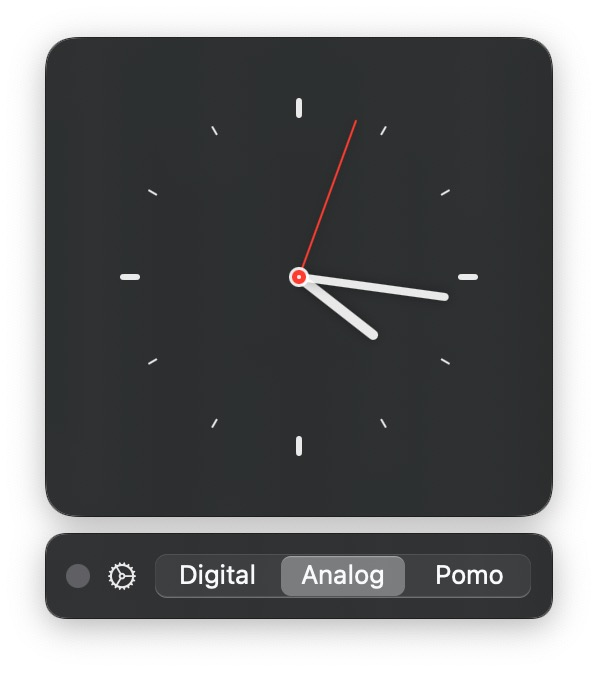

# Floating Clock for macOS

A simple floating clock for macOS, built with SwiftUI.

## TODOs

[ ] Add variable aspect ratio sizing to digital clock
[ ] Add pomodoro timer view
[ ] Add settings to change clock appearance (colour, background)
[ ] Allow to display date as well as time
[ ] Fix performance issues
